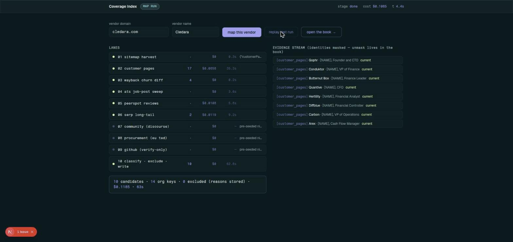
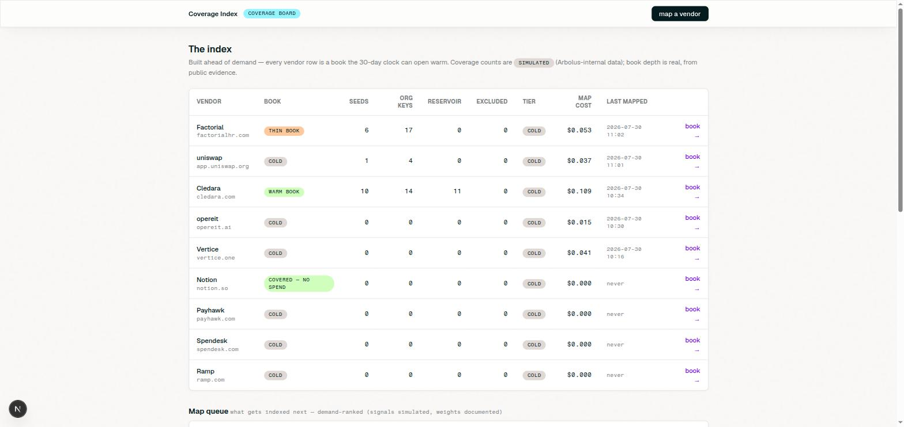

# Coverage Index

Working prototype for the Arbolus Senior Product Manager (Growth) case study — built in 3 days with AI tooling, as the brief encourages.

**Live:** https://arbolus-coverage-index.vercel.app




## The thesis

The index is built **ahead of demand** from public evidence, with provenance and eligibility rules — so when a client opens an uncovered company and the 30-day clock starts, the trigger looks up a **warm book** instead of starting a cold search. One machine, two triggers: the continuous crawl plus activation loops are Challenge 1; the on-demand burst served from the index is Challenge 2.

## What runs live vs what is simulated

| Live (real public data) | Simulated (labelled in the UI) |
|---|---|
| 6-lane map run: sitemap harvest, customer-page extraction, Wayback churn diff, ATS job-post sweep, PeerSpot, SERP long-tail | The demand trigger (their API has no write path — probe-verified) |
| Claude classification: persona class, 4-part confidence decomposition | Arbolus-internal coverage counts |
| The 8 eligibility checks, rejections stored with reasons | The 200k expert reservoir (synthetic base — the **join logic is real**) |
| Per-lane cost + latency journaling, response cache | Invite sends (drafted, never sent — `sent=false` is never flipped) |

## Surfaces

- `/run` — the map run, streaming live over SSE (terminal view)
- `/coverage` — the index at a glance; book depth per vendor
- `/book/[domain]` — candidates under a masking contract (one unmask toggle), exclusions with reasons, reservoir join, channel-legality mask
- `/burst` — the 30-day clock: trigger branch from the real book state, the walk-to-20 with every assumption labelled, cost vs the manual baseline
- `/loop` — the activation loops and the one scoped offer change (R0)

## Stack

Next.js (App Router) + Supabase + Claude API on Vercel. Identities in rendered output are masked by default; evidence provenance is stored in full. AI runs acquisition, matching and verification — it never authors contributor content.

## Run it

```bash
npm i
cp .env.example .env.local   # fill in keys
npm run dev
```

Required env: `SUPABASE_URL`, `SUPABASE_SERVICE_ROLE_KEY`, `ANTHROPIC_API_KEY`; optional: `SERPER_API_KEY` (serp lane reports itself dark without it), `JINA_API_KEY`, `GATE_PASSWORD`.
